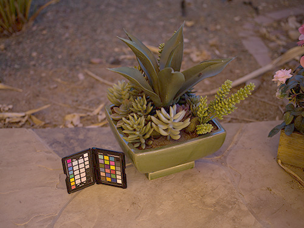
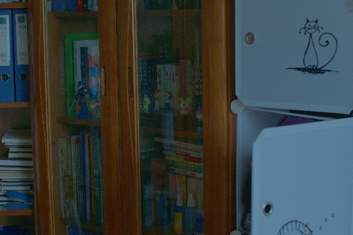
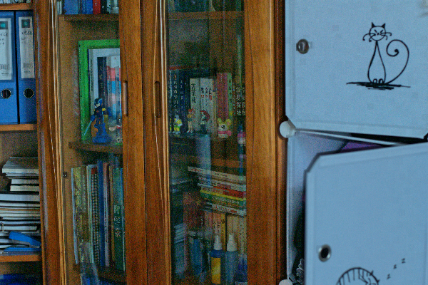

# Conventional Methods for Low-Illumination Image Enhancement
This project is the Python implementation of
several conventional methods for processing
single images with low illumination.


**Conventional** refers to methods that do not need a large dataset of labeled
images to train the model. Instead, the methods utilize 
the inherent information of images.

This project also include **Color Histogram** for each image.

###*Methods:* 
* (1) Histogram Equalization; 
* (2) Gamma Correction;
* (3) Gray World;
* (4) Retinex; (SSR; MSR)
* (5) Max RGB; 
* (6) DeHaze; [[LINK](https://ieeexplore.ieee.org/document/6012107)]
* (7) LIME; [[LINK](https://ieeexplore.ieee.org/abstract/document/7782813)]

###*Data:* 
* LIME dataset: 10 images
* LOL dataset [[LINK](https://daooshee.github.io/BMVC2018website/)]: 15 images are used here  
  You can run this project on your own images

###*Evaluation Indicators:* 
With references: PSNR, SSIM, MAE  
Without references:  Entropy, EME [[LINK](https://ieeexplore.ieee.org/document/908502)]


## Installation
Implemented on **Python 3.8**. 

Please use pip to install all the packages before you run this project.
```
pip install -r requirement.txt
```
## Usage & Examples
```
usage: main.py [-h] [--method {HE,Gamma,Gray_World,Retinex,Max_RGB,DeHaze,LIME}] [--img_path IMG_PATH] [--has_reference HAS_REFERENCE]
               [--eme_size EME_SIZE]

Low Illumination Image Enhancement

optional arguments:
  -h, --help            show this help message and exit
  --method {HE,Gamma,Gray_World,Retinex,Max_RGB,DeHaze,LIME}
                        The method you would like to apply
  --img_path IMG_PATH   Path of the image to be enhanced
  --has_reference HAS_REFERENCE
                        Does the image has a ground truth reference? If true, enter the path of the reference image
  --eme_size EME_SIZE   The window size of matrix EME

optional arguments for method 'Gamma':
  --gamma GAMMA         Gamma < 1

optional arguments for method 'Max_RGB':
  --gamma GAMMA         Gamma < 1
  
optional arguments for method 'Gray_World':
  --gamma GAMMA         Gamma < 1 for low illumination images, if gamma==1, simply apply Gray World

optional arguments for method 'Retinex':
  --model {SSR, MSR}    Single or Multiple
  --sigma_list SIGMA_LIST
                        Sigma list for MSR
  --sigma SIGMA         Sigma for SSR

optional arguments for method 'DeHaze':
  --omega OMEGA         weight of dark channel
  --kernel_size KERNEL_SIZE
                        dark channel kernel size
  --model {origin, enhanced} 
                        choose to use the original dehaze model of the enhanced one

optional arguments for method 'LIME': 
  --gamma GAMMA         Gamma < 1  
  --kernel_size KERNEL_SIZE
                        kernel size of special guassian kernel
  --sigma SIGMA         sigma for building special gaussian kernel                                                                           
  --alpha ALPHA         coefficient to balance the terms in equation 18
```
*Examples:*
```
python main.py --method HE --img_path ./tasks/3.bmp
python main.py --method Gamma --img_path ./tasks/3.bmp --gamma 0.3
python main.py --method Gray_World --img_path ./tasks/3.bmp 
python main.py --method Retinex --img_path ./tasks/3.bmp --model SSR
python main.py --method DeHaze --img_path ./tasks/3.bmp 
python main.py --method LIME --img_path ./tasks/3.bmp
```

## Some Results
### (1) Images without references
Original Image  <div style="width: 100pt">           |  <div style="width: 100pt">Histogram Equalization  | <div style="width: 100pt"> Gamma Correction | <div style="width: 100pt">Gray World |<div style="width: 100pt"> Retinex-SSR |<div style="width: 100pt"> Retinex-MSR) |<div style="width: 100pt"> Max RGB |<div style="width: 100pt"> DeHaze| <div style="width: 100pt">LIME |
:-------------------------:|:-------------------------:|:-------------------------:|:-------------------------:|:-------------------------:|:-------------------------:|:-------------------------:|:-------------------------:|:-------------------------:
  |  | ||||||
**Entropy**  | 611.1124983690238 | 730.3816309833028 | 706.263281421345 |636.036593322102|585.1020636647495| 654.0260442891583|657.5397980870036|742.1913111124674
**EME**  | 15.305165514970348 | 9.420615924178865 |  9.592785267042633 |4.0243145405342675|3.0018271371980196|7.566815617221303|13.392978947612137|13.100082303554595

Entropy and EME are calculated on grayscaled images.

### (2) Images with references

|<div style="width: 100pt">Original Image             | <div style="width: 100pt"> Histogram Equalization  | <div style="width: 100pt"> Gamma Correction |<div style="width: 100pt"> Gray World |<div style="width: 100pt"> Retinex-SSR |<div style="width: 100pt"> Retinex-MSR) |<div style="width: 100pt"> Max RGB |<div style="width: 100pt"> DeHaze-Enhanced| <div style="width: 100pt">LIME |<div style="width: 100pt"> Reference
:-------------------------:|:-------------------------:|:-------------------------:|:-------------------------:|:-------------------------:|:-------------------------:|:-------------------------:|:-------------------------:|:-------------------------:|:-------------------------:|:-------------------------:
 | |||||||||
**PSNR**  | 7.2193280710565455 |18.926744523261327|11.712604563144748|11.646687482226309|15.88358444752949|14.576818280920634|14.390773497344718|11.711098364463519|12.617874619904484|\
**SSIM**  |0.2308841131169599 |0.5830445219236843|0.6672367571607071|0.662676211725519|0.6726973168310817|0.6625939161812796|0.6212743980777758|0.5819588034721623|0.6394874942870507|\
**MAE**  |156.520525| 117.160125|193.67045277777777|193.73516805555556|80.31700694444444|76.13896944444444|191.804525|199.20753472222222|196.52864305555556|\